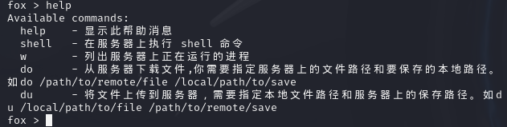

# En-fox用户使用手册

## 1. 概述
本手册提供了如何使用我们的基于RC4加密的通信工具的详细指南。该工具允许用户通过安全的方式与服务器进行交互，包括执行命令、列出进程、上传和下载文件等。
其中服务端.py与客户端py是未采用加密，server.py与client.py采用RC4加密。

## 2. 安装
1. 确保您的系统上安装了`Python 3.x`。
2. 下载或克隆包含客户端和服务器代码的仓库。
3. 确保安装了所需的Python库。
4. 对应的库（`socket`, `os`, `subprocess`, `threading`, `queue`）

## 3. 配置
- 编辑`key`变量以设置用于RC4加密的密钥。确保客户端和服务器使用相同的密钥。
  

## 4. 启动服务器
1. 打开命令行界面。
2. 切换到包含服务器代码的目录。
3. 运行`python server.py`或者`python3 server.py`启动服务器。
   

## 5. 使用客户端
### 6.1 连接到服务器
1. 打开命令行界面。
2. 切换到包含客户端代码的目录。
3. 运行`python client.py`或`python3 client.py`者启动客户端。
4. 输入`help`查看可用命令。

### 6.2 执行命令
- 输入`shell <命令>`在服务器上执行特定的shell命令。

### 6.3 列出进程
- 输入`w`列出服务器上正在运行的进程。

### 6.4 上传文件
- 输入`du <本地文件路径> <服务器保存路径>`将文件上传到服务器。

### 6.5 下载文件
- 输入`do <服务器文件路径> <本地保存路径>`从服务器下载文件。

## 7. 安全与隐私
- 所有传输的数据都使用RC4算法进行加密，以确保通信的安全性。
- 请确保在使用本工具时遵守相关法律法规，不得用于非法用途。

## 8. 故障排除
- 如果连接失败，请检查服务器地址和端口号是否正确。
- 如果命令执行失败，请检查命令格式是否正确，并查看客户端的输出以获取错误信息。

## 9. 联系我们
- 如果您在使用过程中遇到任何问题，或者有任何建议或反馈，请通过[联系我们](https://github.com/GitHub-LP/EN-fox/issues)。与我们联系。

## 10. 版权和许可
- 本软件遵循[指定的许可协议]。版权所有，保留所有权利。

---
